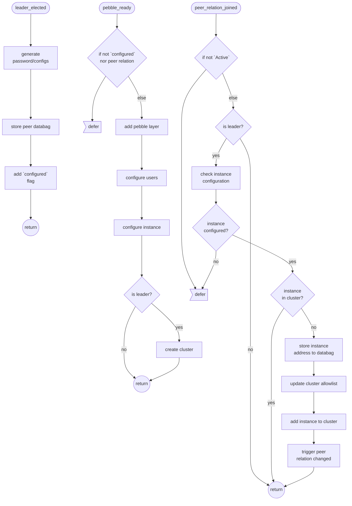
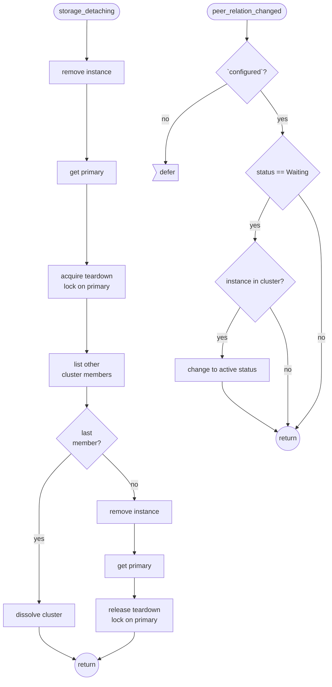

# Contributing

## Overview

This documents explains the processes and practices recommended for contributing enhancements to
this operator.

- Generally, before developing enhancements to this charm, you should consider [opening an issue
  ](https://github.com/canonical/mysql-k8s-operator/issues) explaining your use case.
- If you would like to chat with us about your use-cases or proposed implementation, you can reach
  us at [Canonical Mattermost public channel](https://chat.charmhub.io/charmhub/channels/charm-dev)
  or [Discourse](https://discourse.charmhub.io/).
- Familiarising yourself with the [Charmed Operator Framework](https://juju.is/docs/sdk) library
  will help you a lot when working on new features or bug fixes.
- All enhancements require review before being merged. Code review typically examines
  - code quality
  - test coverage
  - user experience for Juju administrators of this charm.
- Please help us out in ensuring easy to review branches by rebasing your pull request branch onto
  the `main` branch. This also avoids merge commits and creates a linear Git commit history.

## Developing

You can use the environments created by `tox` for development:

```shell
tox --notest -e unit
source .tox/unit/bin/activate
```

### Testing

```shell
tox -e fmt           # update your code according to linting rules
tox -e lint          # code style
tox -e unit          # unit tests
tox -e integration   # integration tests
tox                  # runs 'lint' and 'unit' environments
```

## Build charm

Build the charm in this git repository using:

```shell
charmcraft pack
```

### Deploy

```bash
# Create a model
juju add-model dev
# Enable DEBUG logging
juju model-config logging-config="<root>=INFO;unit=DEBUG"
# Deploy the charm
juju deploy ./mysql-k8s_ubuntu-20.04-amd64.charm \
    --resource mysql-image=ubuntu/mysql
```

## Canonical Contributor Agreement

Canonical welcomes contributions to the MySQL Operator. Please check out our [contributor agreement](https://ubuntu.com/legal/contributors) if you're interested in contributing to the solution.

## Appendix

### Charm lifecycle flowcharts





