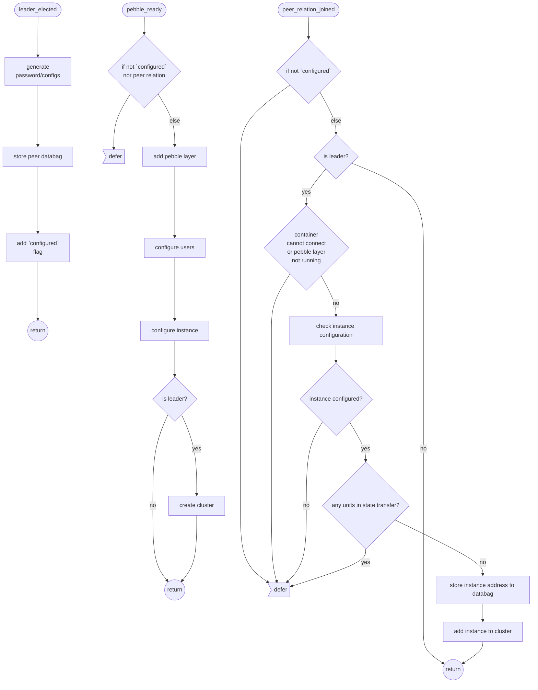

# Charm lifecycle flowcharts

```mermaid
flowchart TD
    id101([leader_elected]) --> id102[generate\npassword/configs]
    id102 --> id103[store peer databag]
    id103 --> id104[add `configured`\nflag]
    id104 --> id105((return))

    id201([pebble_ready]) --> id202{if not `configured` \nnor peer relation}
    id202 --> id203>defer]
    id202 -- else --> id204[add pebble layer]
    id204 --> id205[configure users]
    id205 --> id206[configure instance]
    id206 --> id207{is leader?}
    id207 -- no --> id208((return))
    id207 -- yes --> id209[create cluster]
    id209 --> id208

    id301([peer_relation_joined]) --> id302{if not `configured`}
    id302 --> id303>defer]
    id302 -- else --> id304{is leader?}
    id304 -- no --> id311
    id304 -- yes --> id305{container\ncannot connect\nor pebble layer\nnot running}
    id305 --> id303
    id305 -- no --> id306[check instance configuration]
    id306 --> id307{instance configured?}
    id307 -- no --> id303
    id307 -- yes --> id308{any units in state transfer?}
    id308 -- yes --> id303
    id308 -- no --> id309[store instance address to databag]
    id309 --> id310[add instance to cluster]
    id310 --> id311((return))
```

