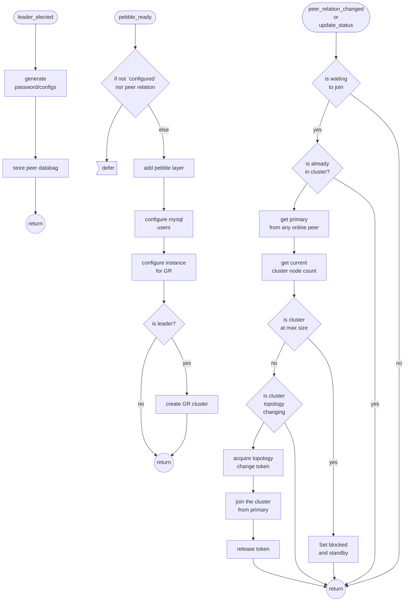

# Charm lifecycle flowcharts

[Click to navigate the mermaid diagram on GitHub](https://github.com/canonical/mysql-k8s-operator/blob/main/docs/explanation/e-flowcharts.md).

```mermaid
flowchart TD
    id101([leader_elected]) --> id102[generate\npassword/configs]
    id102 --> id103[store peer databag]
    id103 --> id104((return))

    id201([pebble_ready]) --> id202{if not `configured` \nnor peer relation}
    id202 --> id203>defer]
    id202 -- else --> id204[add pebble layer]
    id204 --> id205[configure mysql\nusers]
    id205 --> id206[configure instance\nfor GR]
    id206 --> id207{is leader?}
    id207 -- no --> id208((return))
    id207 -- yes --> id209[create GR cluster]
    id209 --> id208

    id301([peer_relation_changed\nor\nupdate_status]) --> id302{is waiting\nto join}
    id302 -- yes --> id303{is already\nin cluster?}
    id303 --> id304[get primary\nfrom any online peer]
    id304 --> id305[get current\ncluster node count]
    id305 --> id306{is cluster\nat max size}
    id306 -- no --> id307{is cluster\ntopology\nchanging}
    id307 --> id309[acquire topology\nchange token]
    id309 --> id310[join the cluster\nfrom primary]
    id310 --> id311[release token]
    id306 -- yes --> id308[Set blocked\nand standby]
    id302 -- no --> id399((return))
    id303 -- yes --> id399
    id307 --> id399
    id308 --> id399
    id311 --> id399
```