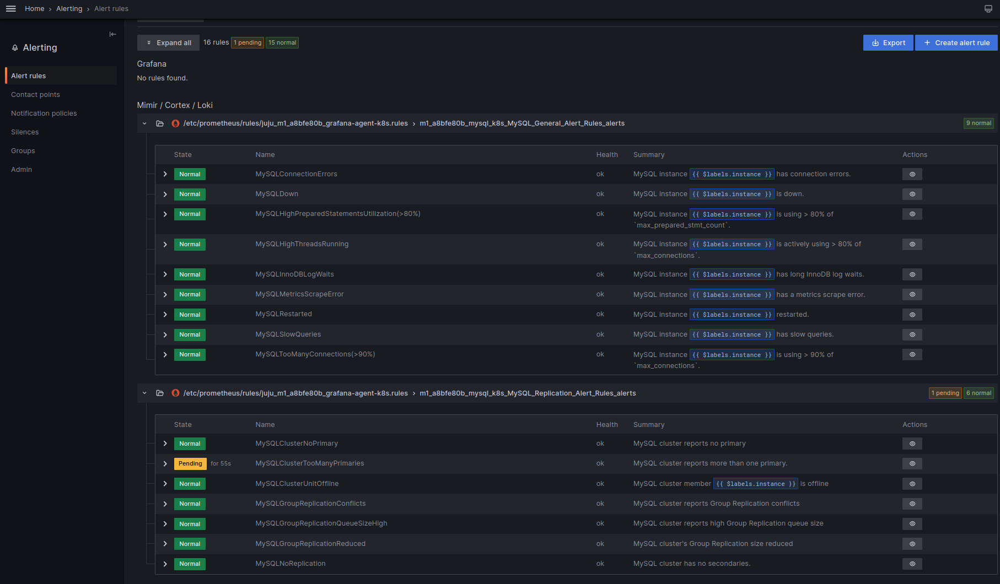
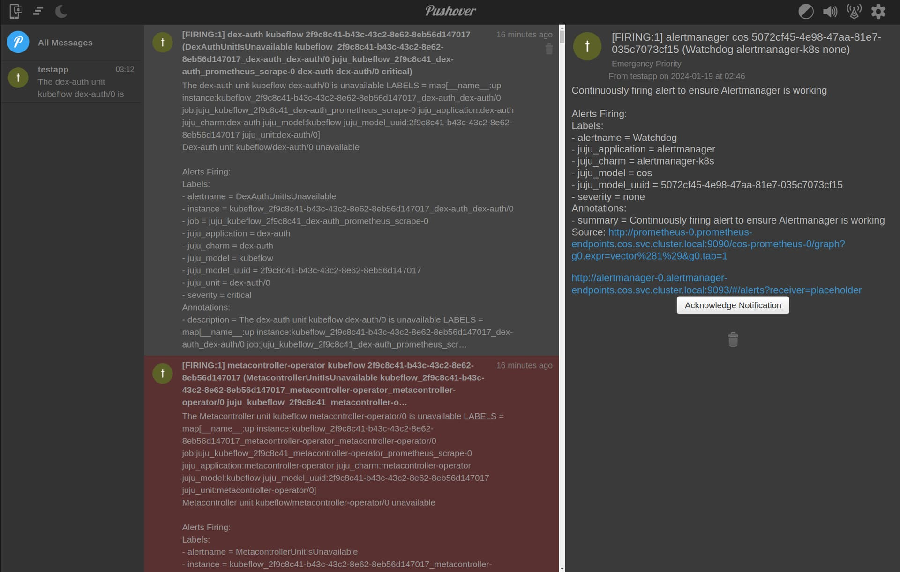

# How to enable COS Alert Rules

This guide will show how to set up [Pushover](https://pushover.net/) to receive alert notifications from the COS Alert Manager with [Awesome Alert Rules](https://samber.github.io/awesome-prometheus-alerts/).

Charmed MySQL K8s ships a pre-configured and pre-enabled list of Awesome Alert Rules.

```{seealso}
* [](/reference/alert-rules)
* [Observability documentation > Add alert rules](https://documentation.ubuntu.com/observability/how-to/adding-alert-rules/)
```

<details><summary>Screenshot of MySQL alert rules in Grafana web interface
</summary>


</details>

## Prerequisites

* `cos-lite` bundle deployed in a Kubernetes environment
  * See the [COS Microk8s tutorial](https://charmhub.io/topics/canonical-observability-stack/tutorials/install-microk8s)
* Fully configured COS monitoring
  * See [](/how-to/monitoring-cos/enable-monitoring)

---

## Enable COS alerts for Pushover

The following section is an example of the [Pushover](https://pushover.net/) alerts aggregator.

The first step is to create a new account on Pushover (or use an existing one). The goal is to have the 'user key' and 'token' to authorize alerts for the Pushover application. Follow this straightforward [Pushover guide](https://support.pushover.net/i175-how-to-get-a-pushover-api-or-pushover-application-token).

Next, create a new [COS Alert Manager](https://charmhub.io/alertmanager-k8s) config (replace `user_key` and `token` with yours):

```shell
cat > myalert.yaml << EOF
```

```yaml
global:
  resolve_timeout: 5m
  http_config:
    follow_redirects: true
    enable_http2: true
route:
  receiver: placeholder
  group_by:
  - juju_model_uuid
  - juju_application
  - juju_model
  continue: false
  group_wait: 30s
  group_interval: 5m
  repeat_interval: 1h
receivers:
- name: placeholder
  pushover_configs:
    - user_key: <relace_with_your_user_key>
      token: <relace_with_your_token>
      url: http://<relace_with_grafana_public_ip>/cos-grafana/alerting/list
      title: "{{ range .Alerts }}{{ .Labels.severity }} - {{ if .Labels.juju_unit }}{{ .Labels.juju_unit }}{{ else }}{{ .Labels.juju_application }}{{ end }} in model {{ .Labels.juju_model }}: {{ .Labels.alertname }} {{ end }}"
      message: "{{ range .Alerts }} Job: {{ .Labels.job }} Instance: {{ .Labels.instance }} {{ end }}"
templates: []
EOF
```

Upload and apply newly the created alert manager config:

```shell
juju switch <k8s_cos_controller>:<cos_model_name>
juju config alertmanager config_file=@myalert.yaml
```

At this stage, the COS Alert Manager will start sending alert notifications to Pushover. Users can receive them on all supported [Pushover clients/apps](https://pushover.net/clients). 


<details><summary>Screenshot of Pushover web client
</summary>


</details>

## Other alert receivers

The similar way as above, COS alerts can be send to the long [list of supported receivers](https://prometheus.io/docs/alerting/latest/configuration/#receiver-integration-settings).

Do you have questions? [Contact us](/reference/contacts)!
