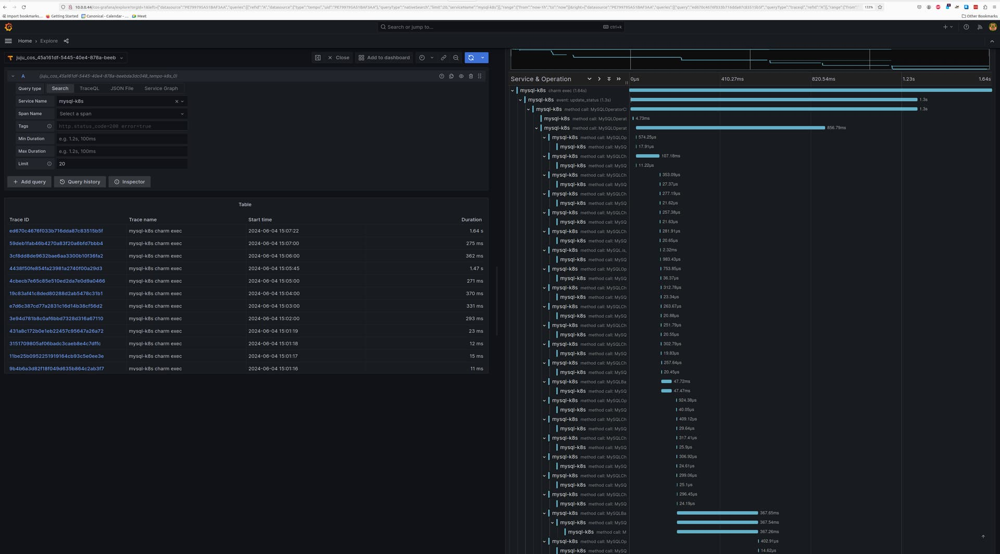

# Enable tracing

This guide contains the steps to enable tracing with [Grafana Tempo](https://grafana.com/docs/tempo/latest/) for your MySQL K8s application. 

```{caution}
This is feature is in development. It is **not recommended** for production environments. 
```

## Prerequisites

* Charmed MySQL K8s revision 146 or higher 
  * See [](/how-to/upgrade/index)
* `cos-lite` bundle deployed in a Kubernetes environment
  * See the [COS Microk8s tutorial](https://charmhub.io/topics/canonical-observability-stack/tutorials/install-microk8s)


---

## Deploy Tempo

First, switch to the Kubernetes controller where the COS model is deployed:

```shell
juju switch <k8s_controller_name>:<cos_model_name>
```

Then, deploy the dependencies of Tempo following [this tutorial](https://discourse.charmhub.io/t/tutorial-deploy-tempo-ha-on-top-of-cos-lite/15489). 

To summarize:
- Deploy the MinIO charm
- Deploy the s3 integrator charm
- Add a bucket in MinIO using a python script
- Configure s3 integrator with the MinIO credentials

Finally, deploy and integrate with Tempo HA in [a monolithic setup](https://discourse.charmhub.io/t/tutorial-deploy-tempo-ha-on-top-of-cos-lite/15489). 


## Offer interfaces

Next, offer interfaces for cross-model integrations from the model where Charmed MySQL is deployed.

To offer the Tempo integration, run

```shell
juju offer <tempo_coordinator_k8s_application_name>:tracing
```

Then, switch to the Charmed MySQL K8s model, find the offers, and integrate (relate) with them:

```shell
juju switch <k8s_controller_name>:<mysql_model_name>

juju find-offers <k8s_controller_name>:  
```
> Do not miss the "`:`" in the command above!

Below is a sample output where `k8s` is the K8s controller name and `cos` is the model where `cos-lite` and `tempo-k8s` are deployed:

```shell
Store  URL                            Access  Interfaces
k8s    admin/cos.tempo                admin   tracing:tracing
```

Next, consume this offer so that it is reachable from the current model:

```shell
juju consume k8s:admin/cos.tempo
```

## Consume interfaces

First, deploy [Grafana Agent K8s](https://charmhub.io/grafana-agent-k8s) from the `1/stable` channel:

```shell
juju deploy grafana-agent-k8s --channel 1/stable
``` 

Then, integrate Grafana Agent K8s with the consumed interface from the previous section:

```shell
juju integrate grafana-agent-k8s:tracing tempo:tracing
```

Finally, integrate Charmed MySQL K8s with Grafana Agent K8s:

```shell
juju integrate mysql-k8s:tracing grafana-agent-k8s:tracing-provider
```

Wait until the model settles. The following is an example of the `juju status --relations` on the Charmed MySQL K8s model:

```shell
Model     Controller  Cloud/Region        Version  SLA          Timestamp
database  k8s         microk8s/localhost  3.5.4    unsupported  16:33:26Z

SAAS   Status  Store       URL
tempo  active  k8s         admin/cos.tempo

App                Version                  Status  Scale  Charm              Channel      Rev  Address         Exposed  Message
grafana-agent-k8s  0.40.4                   active      1  grafana-agent-k8s  1/stable     115  10.152.183.63   no       grafana-dashboards-provider: off, logging-consumer: off, send-remote-write: off
mysql-k8s          8.0.37-0ubuntu0.22.04.3  active      1  mysql-k8s                         0  10.152.183.135  no       Primary

Unit                  Workload  Agent      Address       Ports  Message
grafana-agent-k8s/0*  active    idle       10.1.241.255         grafana-dashboards-provider: off, logging-consumer: off, send-remote-write: off
mysql-k8s/0*          active    executing  10.1.241.253         Primary

Integration provider                Requirer                   Interface              Type     Message
grafana-agent-k8s:peers             grafana-agent-k8s:peers    grafana_agent_replica  peer     
grafana-agent-k8s:tracing-provider  mysql-k8s:tracing          tracing                regular  
mysql-k8s:database-peers            mysql-k8s:database-peers   mysql_peers            peer     
mysql-k8s:restart                   mysql-k8s:restart          rolling_op             peer     
mysql-k8s:upgrade                   mysql-k8s:upgrade          upgrade                peer     
tempo:tracing                       grafana-agent-k8s:tracing  tracing                regular  

```

```{note}
All traces are exported to Tempo using HTTP. Support for sending traces via HTTPS is an upcoming feature.
```

## View traces

The Tempo traces will be accessible from Grafana under the `Explore` section with `tempo-k8s` as the data source. You will be able to select `mysql-k8s` as the `Service Name` under the `Search` tab to view traces belonging to Charmed MySQL.

<details><summary>Screenshot of a Charmed MySQL K8s trace
</summary>


</details>


Feel free to read through the [Tempo HA documentation](https://discourse.charmhub.io/t/charmed-tempo-ha/15531) at your leisure to explore its deployment and its integrations.

